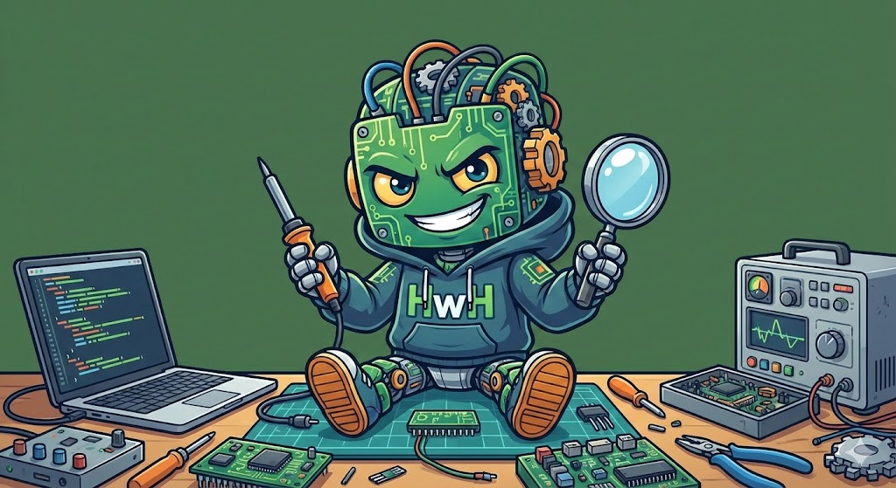

# hwh - Hardware Hacking Toolkit

<p align="center">
  
</p>

A multi-device TUI (Terminal User Interface) for hardware security research. Control multiple hardware hacking tools simultaneously from a single interface.

## Features

- **Multi-Device Support** - Connect and control multiple devices at once
- **Device-Based Tabs** - Each device gets its own tab with all capabilities
- **Split View** - Monitor multiple devices side-by-side
- **SUMP Protocol** - Built-in logic analyzer support
- **Glitch Profiles** - Pre-configured parameters for common targets
- **Firmware Analysis** - Extract, navigate, and search firmware for vulnerabilities

## Supported Devices

| Device | Capabilities |
|--------|-------------|
| Bus Pirate 5/6 | SPI, I2C, UART, JTAG Scan, Logic Analyzer |
| Curious Bolt | Voltage Glitching, Logic Analyzer, Power Analysis |
| Tigard | SPI, I2C, UART, JTAG, SWD |
| FaultyCat | EMFI, Pin Detection |
| TI-Link/MSP-FET | JTAG, SWD, EnergyTrace, BSL |
| Black Magic Probe | SWD, JTAG, GDB Server |

## Installation

### pip (Recommended)

```bash
pip install hwh
```

### Homebrew (macOS)

```bash
brew tap ResistanceIsUseless/hwh
brew install hwh
```

### Docker

```bash
docker run -it --privileged -v /dev:/dev resistanceisuseless/hwh
```

### From Source

```bash
git clone https://github.com/ResistanceIsUseless/hwh.git
cd hwh
pip install -e .
```

## Usage

### Launch TUI

```bash
hwh
```

Or explicitly:

```bash
hwh tui
```

### CLI Commands

```bash
# List connected devices
hwh devices

# Connect to specific device
hwh connect "Bus Pirate 5"

# Read SPI flash
hwh spi read --device "Bus Pirate 5" --output dump.bin

# Run glitch sweep
hwh glitch sweep --device "Curious Bolt" --width 100-500 --offset 0-1000
```

### Keyboard Shortcuts (TUI)

| Key | Action |
|-----|--------|
| `d` | Go to Devices tab |
| `f` | Go to Firmware tab |
| `s` | Toggle split view |
| `q` | Quit |
| `?` | Show help |
| `Tab` | Switch between panels |

## Firmware Analysis

The Firmware tab provides tools for analyzing firmware images without requiring hardware:

### Features
- **Extraction** - Scan and extract SquashFS, JFFS2, UBIFS, CPIO filesystems
- **File Browser** - Navigate extracted filesystem with tree view
- **Security Search** - Find hardcoded credentials, API keys, private keys
- **Binary Analysis** - Detect unsafe functions in ELF binaries
- **Pattern Search** - Custom regex search across all files
- **Findings Export** - Export results to TXT, JSON, or CSV

### Dependencies
```bash
# Required
brew install binwalk

# Recommended for better extraction
brew install sasquatch squashfs-tools
pip install jefferson ubi_reader
```

### Commands
```
load <path>     - Load firmware file
scan            - Scan for filesystems
extract         - Extract all filesystems
analyze         - Run full security scan
creds           - Scan for credentials only
search <regex>  - Search with custom pattern
export [format] - Export findings (txt/json/csv)
```

## Configuration

Configuration is stored in `~/.config/hwh/config.toml`:

```toml
[devices]
# Auto-connect to these devices on startup
auto_connect = ["Bus Pirate 5", "Curious Bolt"]

[glitch]
# Default glitch parameters
default_width = 350
default_repeat = 1000

[ui]
# Theme: "dark" or "light"
theme = "dark"
```

## Development

```bash
# Clone and install in development mode
git clone https://github.com/ResistanceIsUseless/hwh.git
cd hwh
pip install -e ".[dev]"

# Run tests
pytest

# Format code
black src/
ruff check src/
```

## Architecture

```
hwh/
├── cli.py              # CLI entry point
├── detect.py           # Device detection
├── glitch_profiles.py  # Pre-configured glitch parameters
├── backends/
│   ├── base.py         # Backend base classes
│   ├── buspirate.py    # Bus Pirate backend
│   ├── bolt.py         # Curious Bolt backend
│   └── sump.py         # SUMP protocol for logic analyzers
├── firmware/
│   ├── extractor.py    # Firmware extraction engine
│   ├── analyzer.py     # Security analysis engine
│   └── patterns.py     # Vulnerability patterns
└── tui/
    ├── app.py          # Main TUI application
    ├── style.tcss      # Styling
    └── panels/         # Device-specific UI panels
```

## License

MIT License - see [LICENSE](LICENSE) for details.

## Credits

- TUI framework: [Textual](https://textual.textualize.io/)
- Design inspiration: [glitch-o-bolt](https://rossmarks.uk/git/0xRoM/glitch-o-bolt)
- Color scheme: Metagross Pokemon colors
